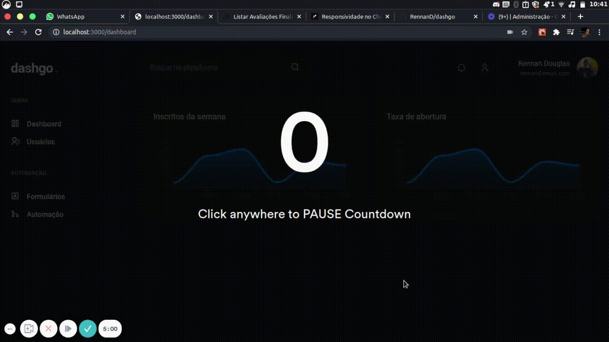

<h1 align="center" >
  dashgo .
</h1>


<h2 align="center"> 
  A beautiful admin dashboard 💜
</h2>

<h3 align="center">
  This app has developed using React with Next Js.
</h3>

# Cloning this repository

```
git clone https://github.com/RennanD/dashgo.git
```

# ❗️ Requisites

For this aplication we need have installed:

- [Node](https://nodejs.org/en/)
- [Yarn](https://yarnpkg.com/lang/en/) (Optional)

## 💻 Web Application

<h1 align="center">
    
</h1>

<h3 align="center">
  This is an application that aims to create a complete dashboard and next to that, use a modern interface.
</h3>

<p>
  In this project we use:
</p>

- [Chakra UI](https://chakra-ui.com/), to crate the interface.
- [React Query](https://react-query.tanstack.com/), for application data fetching.
- [React Hook Form](https://react-hook-form.com/), for work with forms

### ⚡️ Start

To start application, run:

```
cd dashgo
yarn
yarn dev

# or

cd dash
npm install
npm run dev
```
To simulate pruduction project

```
yarn build
yarn start

# or

npm run build
npm run start
```

Our app is runnig on [localhost:3000](http://localhost:3000)

# App Demo

<h1 align="center">
    
</h1>
